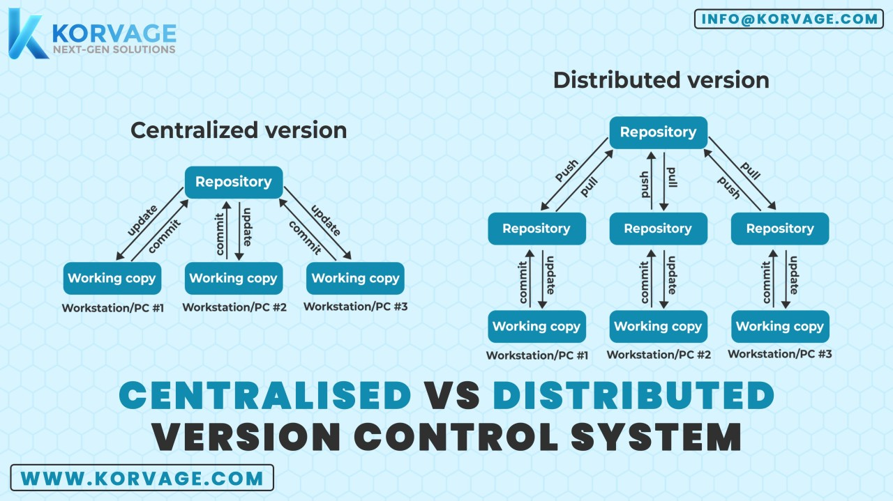

# Git & GitHub — Complete Notes (Part 1: Basics)
*Written for a true beginner going into fresher/intermediate interviews*

> This is Part 1 of a multi-part series. Part 2 (advanced Git) and Part 3 (hands-on practice) will come later. This file stands on its own — nothing here refers to any specific college syllabus, so anyone reading it from scratch can follow it.

---

## 0. How These Notes Work

- Every new command or term is **explained in plain English first**, then given a **real-life analogy**, and only then shown as a code command. You should never hit a line of code here without already knowing *why* it exists.
- Any word that might be new to you gets defined the first time it's used, right there in brackets — you won't need to Google anything mid-read.
- At the end, there's a **Q&A section with full answers written the way you'd actually say them out loud in an interview** — not just the question.

---

## 1. What Problem Does Git Actually Solve?

Imagine you're writing a college assignment in a Word document, alone, with no version control. You save it as `assignment.docx`. The next day you make big changes and you're not sure if they're good, so you save a copy as `assignment_v2.docx`. Then `assignment_final.docx`. Then `assignment_final_FINAL.docx`. Then `assignment_final_FINAL_ACTUALLY.docx`.

This is the exact problem every software team used to have, at a much bigger scale, with hundreds of files and multiple people editing at the same time. **Version control systems (VCS)** were invented to solve this properly: instead of renaming files, the system automatically tracks every change, who made it, when, and why — and lets you go back to any previous version instantly.

**Version Control System (VCS):** software that records changes to a set of files over time, so you can view or restore any earlier version whenever you need to.

There are two broad categories:

**a) Centralized Version Control (CVCS)** — example: SVN (Subversion).
Here, there is one single central server that holds the *entire* project history. Every developer's computer only holds the current files, not the history. Think of this like a **single library building** that holds every book ever written on a topic — if that one building burns down, all that historical knowledge is gone forever. Also, to check history or make a change, you always need to be connected to that one server.

**b) Distributed Version Control (DVCS)** — example: Git, Mercurial.
Here, every single developer's computer has a **complete copy of the entire project history**, not just the current files. Think of this like everyone in a book club having their own full personal copy of every edition of a book ever printed. If one person's laptop is destroyed, nothing is lost — everyone else still has the complete history. And because you have everything locally, you can look at old history, make commits, and create branches **without even needing internet access.**

Git belongs to category (b). This is a genuinely important interview point: many people memorize "Git is distributed" without understanding *why* that matters — now you know why.

---



## 2. What Exactly Is Git?

**Git** is a free, open-source, distributed version control system. It was created in **2005 by Linus Torvalds** — the same person who created the Linux operating system kernel. He built Git because the tool the Linux project was using at the time (a paid tool called BitKeeper) stopped being available to them for free, and no existing free tool was fast or reliable enough for a project as huge as Linux. So he wrote Git in a very short time specifically to be fast, reliable, and fully distributed.

**In one sentence for an interview:** *"Git is a distributed version control system that tracks changes to source code over time, allowing multiple developers to work on the same project without overwriting each other's work."*

---

## 3. Git vs GitHub — Understand This Difference Perfectly

This confuses almost every beginner, so let's use a strong analogy.

Think of **Git like Microsoft Word** — it's software installed on your computer that lets you write and track changes in a document. It works completely offline. You don't need any internet connection to open Word and type.

Think of **GitHub like Google Drive** — it's an online, cloud-based place where you can upload your Word documents so that other people can view them, download them, comment on them, and collaborate with you. Google Drive itself doesn't let you *write* the document — Word does that. Drive just stores it, and adds collaboration features on top.

So:
- **Git** = the actual version control tool, installed locally, works fully offline, invented by Linus Torvalds.
- **GitHub** = a website/cloud service that *hosts* Git repositories online, adding features like Pull Requests, Issues, and team collaboration tools on top of Git. It is owned by Microsoft (since 2018).

| | Git | GitHub |
|---|---|---|
| What it is | A version control **tool** | A **hosting website/service** for Git repositories |
| Needs internet? | No, works fully offline | Yes, it's a website |
| Who made it | Linus Torvalds | Originally an independent company, now owned by Microsoft |
| What it adds | Tracking history, branching, merging | Pull Requests, Issues, team collaboration, CI/CD (GitHub Actions) |

> **Interview trap question: "Is GitHub necessary to use Git?"**
> No — this is a very common misunderstanding. You can use Git entirely on your own laptop with zero internet connection and zero GitHub account. GitHub is just *one* of several companies (GitLab and Bitbucket are others) that offer a place to host your Git repository online so others can access it.

---

## 4. Setting Up Git on Your Computer

Before using Git, you tell it who you are, so that every change you make gets correctly labeled with your name and email (this is what shows up in project history as "who did this change").

```bash
git --version
```
This simply checks that Git is installed and shows you which version you have.

```bash
git config --global user.name "Your Name"
git config --global user.email "you@example.com"
```
**What this actually does:** it saves your name and email into a settings file so that every future commit (a "commit" is a saved snapshot of changes — explained fully in the next section) is automatically labeled as being made by you. You only need to do this once per computer, not once per project.

**What does `--global` mean?**
Git configuration works at three levels, like settings on your phone:
- `--global` → applies to **every** Git project on your computer (like a phone-wide setting, e.g. your default ringtone).
- `--local` (this is the default if you don't type any flag) → applies **only** to the one specific project you're currently in (like a per-app notification setting).
- `--system` → applies to every user account on that machine (rarely used by individual developers).

```bash
git config --list
```
This just prints out all the settings currently saved, so you can double check your name/email got set correctly.

---

## 5. The Git Lifecycle — The Most Important Concept in This Whole File

If you only remember one diagram from all of Git, remember this one. Almost every command you'll ever run moves a file between these four stages.

**Analogy: Think of Git like preparing and mailing a parcel.**

1. **Working Directory (your desk)** — This is simply the actual folder on your computer where your project files live, exactly as you're editing them right now. It's like items scattered on your desk that you're still deciding whether to include in a parcel.

2. **Staging Area / "Index" (the packing box)** — This is a waiting area where you place items you've *decided* to include in your next parcel, but haven't sealed the box yet. You can still change your mind and take something back out.

3. **Local Repository (the sealed, labeled parcel sitting in your house)** — Once you seal the box (this is what a **"commit"** does), it becomes a permanent, labeled record — a **snapshot** of exactly what was inside at that moment, stored safely in your own house (your computer, inside a hidden folder called `.git`). This snapshot can never silently change after the fact.

4. **Remote Repository (the parcel after you've posted it to the delivery company)** — This is when you actually send your sealed parcel (your commit) off to a shared, online location — GitHub, in most cases — so that other people (teammates) can also access it.

```
Working Directory  --(git add)-->  Staging Area  --(git commit)-->  Local Repository  --(git push)-->  Remote Repository
        ^                                                                    |
        |__________________________(git pull / git checkout)_______________|
```

**Why does the "staging area" (the packing box) even need to exist? Why not just commit everything directly?**
Because it lets you be deliberate. Imagine you changed 5 files while working: 3 of them are a finished bug fix, and 2 are unrelated experiments you're still testing. Without a staging area, you'd be forced to save (commit) all 5 changes together as one confusing, mixed bundle. With the staging area, you can choose to "pack" (stage) only the 3 finished files, seal that box (commit) with a clear label like "Fix login bug," and deal with the other 2 files separately later. This keeps your project's history clean and understandable — which matters a lot when a teammate (or an interviewer looking at your GitHub) is trying to understand what each commit actually did.

### The Four States a File Can Be In

- **Untracked** — Git has never been told about this file before. It exists on your desk, but Git isn't watching it at all yet.
- **Modified** — Git already knows this file, but you've changed its content since the last commit, and Git has noticed the difference.
- **Staged** — You've placed this specific version of the file into the "packing box," ready to be included in the next commit.
- **Committed** — The file's current version is now safely sealed inside a permanent snapshot in your local repository.

---

## 6. Common Commands — Fully Explained, Not Just Listed

### `git init` — Starting a Brand New Project

```bash
git init
```
**What it actually does:** creates a new, empty Git repository inside your current folder. Practically, it creates a hidden folder named `.git` where all of Git's tracking information, history, and settings for this project will live. You only run this **once**, at the very beginning of a new project.

**Analogy:** this is like buying a blank notebook and writing "Project Diary" on the cover — the notebook itself is now ready to have entries written in it, but it's currently empty.

### `git clone` — Copying an Existing Project

```bash
git clone <url>
```
**What it actually does:** downloads a complete copy of an existing project — including every single past commit, all its history — from somewhere like GitHub onto your own computer.

**Analogy:** instead of starting a blank notebook, this is like photocopying an entire friend's diary, page by page, including every past entry, so you now have your own full copy to read and add to.

### `git status` — "What's Going On Right Now?"

```bash
git status
```
**What it actually does:** shows you the current state of your files — which ones are untracked, which are modified but not staged, and which are staged and ready to commit.

**Analogy:** this is like glancing at your desk and the packing box together and asking "what's still loose on the desk, and what have I already packed?" You'll run this command constantly — it's completely harmless (it never changes anything), so run it any time you're unsure what state you're in.

### `git add` — Moving Something Into the Packing Box (Staging)

```bash
git add <filename>
```
**What it actually does:** takes one specific file's current changes and moves them from "Working Directory" into the "Staging Area" — i.e., you're telling Git "yes, I want this exact version of this file included in my next commit."

```bash
git add .
```
**What this does differently:** the dot (`.`) means "everything in this folder and its subfolders" — so instead of naming one file, this stages *all* changed and new files at once.

> **Be careful with `git add .` as a beginner** — it's easy to accidentally stage files you didn't mean to commit (like a temporary test file, or worse, a file with passwords in it). As a habit, prefer staging specific files by name until you're confident about what's in your folder.

### `git commit` — Sealing the Box (Saving a Permanent Snapshot)

```bash
git commit -m "message"
```
**What it actually does:** takes everything currently in the staging area and permanently saves it as a new snapshot in your local repository. The `-m` flag lets you attach a short message describing *what* this snapshot changed and *why* — this message becomes a permanent, visible part of your project's history forever.

**Analogy:** this seals the packing box and writes a label on it, like "Box 3: Winter clothes, packed 5th July" — from this point on, the contents of that box are locked in and recorded.

**Why does the commit message actually matter?**
Six months later, when you or a teammate is trying to figure out why a certain change was made, the commit message might be the *only* clue available. A message like `"fixed stuff"` tells you nothing. A message like `"Fix null pointer exception when user submits empty login form"` tells the whole story instantly.

```bash
git commit -am "message"
```
**What this shortcut does:** it combines staging and committing into one step, but ONLY for files that Git was **already tracking** before (i.e., files that existed in a previous commit and have since been modified). 

> **Important beginner trap:** if you created a brand-new file that Git has never seen before (an "untracked" file), `-am` will **NOT** include it, because `-am` only works on already-tracked, modified files. You must `git add` a new file at least once manually before `-am` will ever pick it up automatically in future commits.

### `git log` — Reading the Project's Diary

```bash
git log
```
**What it actually does:** shows the full history of every commit ever made — who made it, when, and the full message — starting from the most recent and going backward.

```bash
git log --oneline
```
**What this variation does:** shows the exact same history, but compresses each commit down to a single short line (just a short ID and the message) so it's much easier to scan quickly.

```bash
git log --graph --all --oneline
```
**What this variation does:** adds a visual, text-based diagram showing how different branches (parallel lines of work — explained fully in the workflows section below) split apart and rejoined over time. This is genuinely useful to run before a team meeting or interview demo, because it lets you *see* the shape of the project's history at a glance instead of reading a plain list.

### `git show <commit-id>` — Zooming Into One Specific Commit

```bash
git show <commit-hash>
```
**What it actually does:** every commit has a unique ID (a long string of letters and numbers called a **hash**, generated automatically by Git). This command shows you the full details of exactly what changed in that one specific commit.

### Undoing Mistakes — Four Different Tools, Four Different Situations

This is one of the most confusing areas for beginners because there are several similar-sounding commands. Let's separate them clearly by **what situation each one is meant for.**

**Situation A: "I changed a file but haven't staged it yet, and I want to throw away my edits and go back to the last commit."**
```bash
git restore <filename>
```
Analogy: you scribbled on a page in your notebook, decided you hate it, and simply erase your scribble to go back to what was written before.

**Situation B: "I staged a file (put it in the packing box) by mistake, but I haven't committed yet, and I want to take it back out of the box (without deleting my actual edits)."**
```bash
git restore --staged <filename>
```
Analogy: you put an item into the packing box, but changed your mind about including it in *this* particular parcel — you take it back out of the box, but it's still sitting right there on your desk, unchanged.

**Situation C: "I've already committed (sealed the box), but now I want to undo that commit, and nobody else has downloaded it yet."**
```bash
git reset --soft <commit>     # undoes the commit, but keeps your changes staged
git reset --mixed <commit>    # undoes the commit, keeps your changes but unstaged (this is the default if you don't specify)
git reset --hard <commit>     # undoes the commit AND permanently deletes the changes — dangerous!
```
Analogy: this is like ripping open a box you already sealed and taping shut. `--soft` puts the contents right back into the packing box, ready to be re-packed differently. `--mixed` dumps the contents back onto your desk, loose. `--hard` literally throws the contents in the trash — use this one only when you are completely sure you don't need those changes anymore.

**Situation D: "I've already committed AND already shared/pushed it to a place others can see, and I want to undo it without erasing history that others may have already downloaded."**
```bash
git revert <commit>
```
**What it actually does:** instead of destroying the old commit, it creates a **brand new commit** that does the exact opposite of the old one — effectively cancelling it out, while keeping a full, honest historical record that both the mistake *and* the fix happened.

Analogy: instead of tearing up a page you already mailed to someone, you write a brand new page that says "please ignore my previous letter, here is the correction" — nothing is erased, but the record is now accurate.

> **This exact distinction — reset vs revert — is one of the most commonly asked "do you actually understand Git" interview questions.** The short way to say it out loud: *"I use `reset` for undoing my own local, unshared mistakes, and `revert` for safely undoing something that's already been pushed and might be in use by others."*

---

## 7. Git Workflows — How Real Teams Organize Their Work

A **"branch"** is simply an independent line of work — a separate copy of the project where you can make changes without affecting the main, stable version, until you're ready to combine them back together. (We'll go hands-on with branching in a later part — for now, just understand *why* teams organize their branches the way they do.)

**a) Centralized Workflow**
Everyone commits their changes directly onto one single shared branch (usually called `main`). 
**Analogy:** this is like ten people editing the exact same live Google Doc at the same time, with no separate drafts — fine for very small teams, but changes can easily clash and overwrite each other as the team grows.

**b) Feature Branch Workflow**
Every new feature or bug fix gets its own separate branch, and is only combined back into `main` after it's reviewed (through something called a **Pull Request**, explained in the GitHub section later).
**Analogy:** this is like everyone working on their own separate draft copy of a chapter, and only merging their chapter into the final book after an editor has reviewed it. This is the most common approach used by small-to-medium companies today.

**c) Gitflow Workflow**
A more strict, structured version of the feature branch idea, with specific named branches for specific purposes:
- `main` — the actual live, production-ready code
- `develop` — where finished features are combined before an official release
- `feature/*` — individual new features being built
- `release/*` — a branch used briefly to prepare and polish an upcoming release
- `hotfix/*` — urgent fixes made directly against `main` when something is broken in production right now

**Analogy:** this is like a publishing house with a very formal process — draft chapters, an editing stage, a final proofreading stage before printing, and a special emergency reprint process if an error is found after the book is already published. It's good to *know* this exists, but many modern startups use the simpler feature-branch approach instead, so don't over-invest time memorizing every rule of Gitflow.

**d) Forking Workflow**
Used heavily in **open-source projects**. Instead of getting direct permission to edit someone else's project, you first create your own personal copy of their entire repository under your own account (this copy is called a **"fork"**). You make your changes in your own fork, then you ask the original project's maintainers to review and pull your changes into their project (this request is called a **Pull Request**).

**Analogy:** imagine a famous author's manuscript is publicly available for suggestions. You can't just edit their original file — instead, you photocopy the whole manuscript, mark up your suggested edits on your copy, and then send your marked-up copy back to the original author, asking them to consider merging your suggestions in.

> **Interview angle:** "How would you contribute to an open-source project you don't have direct write access to?" → *"I'd fork the repository into my own account, clone my fork to my computer, make my changes on a new branch, push that branch to my fork, and then open a Pull Request from my fork back to the original project."*

---

## 8. Working With Remote Repositories

A **"remote"** is simply a version of your project that's stored somewhere else — usually on GitHub — rather than on your own computer. Think of it as the shared, online copy that your whole team can access, compared to your own personal, local copy on your laptop.

```bash
git remote add origin <url>
```
**What this does:** connects your local project to an online repository, and gives that connection a nickname — by convention, that nickname is almost always called `origin`.

**Analogy:** this is like saving a shared Google Drive folder's link under a bookmark named "origin" in your browser, so you don't have to type the full link every time.

```bash
git remote -v
```
Shows you which remote(s) your project is currently connected to.

```bash
git push origin main
```
**What this does:** takes your local commits (sealed parcels sitting in your house) and physically sends them to the remote/online repository, so your teammates can now see and download them too.

```bash
git push -u origin main
```
The `-u` sets up "tracking" between your local `main` branch and the remote `main` branch, so that afterward you can simply type `git push` with no extra arguments, and Git will remember where to send it.

```bash
git fetch origin
```
**What this does:** downloads any new commits that exist on the remote repository, **but does not touch your own working files at all.** It just lets you look and compare first.

**Analogy:** this is like checking the shared Google Drive folder and seeing "3 new files were added by teammates," without actually opening or merging them into your own local folder yet.

```bash
git pull origin main
```
**What this does:** this is actually two steps combined — it first does a `fetch` (downloads the new changes), and then immediately `merges` them into your current branch, updating your actual working files right away.

> **The most commonly asked beginner interview question in this whole section: "What's the difference between `git pull` and `git fetch`?"**
> `fetch` is the safe, "look but don't touch" option — it downloads new information but leaves your current work completely untouched, so you can review what changed before deciding what to do. `pull` is the "just get me up to date now" option — it downloads *and* immediately merges the changes into your current branch in one step. A more cautious habit at work is to `fetch` first, look at what changed with `git log origin/main`, and only then decide to merge or pull.

**What do "origin" and "upstream" mean?**
- `origin` is simply the conventional nickname for the remote you originally cloned your project from.
- `upstream` is a nickname commonly used specifically in the forking workflow (explained above) to refer to the *original* project, when the repository you cloned is actually your own personal fork of someone else's project.

---

## 9. Practical Habits Every Developer Needs

### `.gitignore` — Telling Git What to Never Track

Some files should *never* be saved into your project's history — temporary files, huge auto-generated folders (like `node_modules`), and — very importantly — files containing secret information like passwords or API keys.

A `.gitignore` file is simply a plain text file where you list, line by line, which files or folders Git should completely ignore and never track, no matter what.

Example `.gitignore` content:
```
node_modules/
*.log
.env
__pycache__/
```

### The Classic Real-World Disaster: Accidentally Pushing a `.env` File

A `.env` file is a common place developers store sensitive configuration values — things like database passwords and API keys — that should never be shown publicly.

**Here's exactly what happens if you accidentally commit and push a `.env` file to a public GitHub repository:**

Automated bots constantly scan public GitHub repositories, searching specifically for exposed secrets like passwords and API keys. Within minutes — sometimes seconds — of your push, one of these bots can find your exposed credentials. There are real, well-documented cases of developers having their cloud hosting bills run up to thousands of dollars overnight, or their entire databases deleted, purely because a `.env` file was accidentally made public.

Here's the part that surprises most beginners: **even if you notice your mistake and delete the `.env` file in your very next commit, the damage is already done.** The file still exists, fully readable, inside your project's *history* — anyone can look at an old commit and find it, even though the file is "deleted" in the current version.

**The correct fix, step by step:**
1. **Immediately change (rotate) every single password and API key that was exposed.** This is the single most important step — treat the old credentials as permanently compromised, because you cannot guarantee no one has already seen or copied them.
2. Create (or fix) your `.gitignore` file so `.env` can never be accidentally committed again.
3. Actually scrub the secret out of your project's *history* (not just the current version) using a tool built for this purpose, such as `git filter-repo` (the modern recommended tool) or the older `BFG Repo-Cleaner`.
4. Since this process rewrites history, you'll need to force-push the cleaned history, and ask any collaborators to re-download (re-clone) the project fresh, since their old copies still contain the exposed secret in their local history too.

**Prevention is far easier than the fix:** always create your `.gitignore` file — with `.env` already listed in it — *before* you make your very first commit in a new project.

### Writing Good Commit Messages

A good commit message is short, written in present tense, and clearly describes what changed: `"Fix null pointer error in login handler"` is far more useful than `"fixed stuff"` or `"update"`. Many real companies follow a structured style called **Conventional Commits**, where messages start with a short tag describing the type of change, such as `feat:` (a new feature), `fix:` (a bug fix), or `chore:` (routine maintenance work) — for example: `feat: add password reset functionality`. Mentioning that you're aware of this convention is a small but noticeable plus point in interviews.

### Amending a Commit

```bash
git commit --amend -m "corrected message"
```
**What it does:** lets you edit your most recent commit — either to fix a typo in the message, or to add a file you forgot to include — instead of creating a whole new separate commit for a tiny correction.

> **Important warning:** only use `--amend` on a commit that you have **not yet pushed** anywhere. If you amend a commit that others have already downloaded, you create a mismatch between your history and theirs, which causes confusing errors for your teammates.

---

## 10. Rapid Fire Interview Q&A — With Full Answers

**Q1: What is Git?**
**A:** Git is a free, open-source, distributed version control system that tracks changes made to a project's files over time. It lets multiple people work on the same project simultaneously, keeps a complete history of every change, and allows anyone to go back to any previous version whenever needed.

**Q2: What is the difference between Git and GitHub?**
**A:** Git is the actual version control software installed on your computer, and it works completely offline. GitHub is a separate, cloud-based website that hosts Git repositories online, adding collaboration features like Pull Requests and Issues on top. Git is the tool; GitHub is one of several companies that host it online — you can use Git without ever using GitHub.

**Q3: What is a repository?**
**A:** A repository (often shortened to "repo") is simply a project folder that Git is tracking. It contains your actual project files, plus a hidden `.git` folder that stores the entire history of every change ever made to those files.

**Q4: What is the staging area, and why does it exist?**
**A:** The staging area is a middle step between editing a file and permanently saving (committing) it. It exists so that you can choose exactly which specific changes go into your next commit, rather than being forced to commit every single change in your project folder all at once. This lets you build clean, focused, well-organized commits.

**Q5: What is the difference between `git pull` and `git fetch`?**
**A:** `git fetch` downloads new changes from the remote repository but does not touch your current working files — it only lets you see what's changed. `git pull` does both steps at once: it fetches the new changes and immediately merges them into your current branch. Fetch is the safer, "look first" option.

**Q6: What is the difference between `git clone` and `git init`?**
**A:** `git init` creates a brand new, empty Git repository from scratch in your current folder. `git clone` downloads a complete copy of an already-existing repository — including its entire history — from somewhere like GitHub, onto your own computer.

**Q7: What is `HEAD` in Git?**
**A:** `HEAD` is simply a pointer that tells Git which commit or branch you are currently looking at and working on. Most of the time it points to the latest commit on whichever branch you currently have checked out.

**Q8: What is the difference between `git reset` and `git revert`?**
**A:** `git reset` moves your branch backward and can permanently erase later commits — it's meant for undoing your own mistakes before you've shared them with anyone else, since it rewrites history. `git revert` instead creates a brand new commit that cancels out an earlier one, without erasing any history — this makes it the safe choice for undoing something that has already been pushed and possibly downloaded by others.

**Q9: What is a `.gitignore` file used for?**
**A:** It's a plain text file where you list specific files or folders that Git should never track or commit — commonly used for temporary files, large auto-generated folders, and files containing sensitive information like passwords or API keys.

**Q10: What would you do if you accidentally committed and pushed a file containing a password or API key?**
**A:** First and most importantly, I would immediately change (rotate) that exact password or API key, since it should be treated as compromised the moment it's exposed publicly — simply deleting the file afterward is not enough, because it still exists in the project's history. Then I'd add the file to `.gitignore` to prevent it happening again, use a tool like `git filter-repo` to properly remove it from the project's history, and finally force-push the cleaned history while asking any collaborators to re-clone the project fresh.

**Q11: What is the difference between `git merge` and `git pull`?**
**A:** `git merge` combines two branches that already exist locally on your computer. `git pull` is a slightly different, remote-focused operation — it first fetches new commits from a remote repository, and then performs a merge (or sometimes a rebase, depending on configuration) to bring your current branch up to date with those new remote changes.

**Q12: Why is Git called a "distributed" version control system?**
**A:** Because every single developer's computer holds a complete copy of the entire project's history, not just the current files — unlike older, centralized systems where only one central server holds the full history. This means you can commit, create branches, and view your project's entire history offline, and there's no single point of failure if one computer or server goes down.

---

*(Part 2 — advanced Git topics — and Part 3 — the hands-on practical lab — will follow in separate files, as you requested.)*